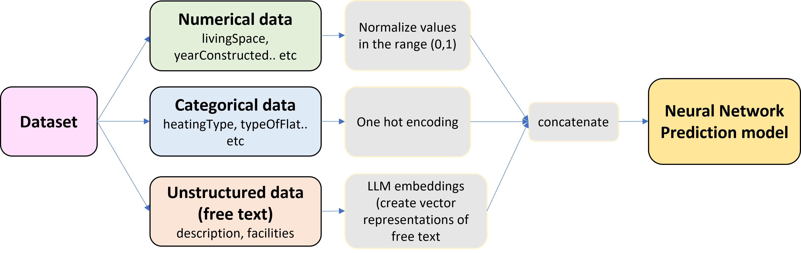
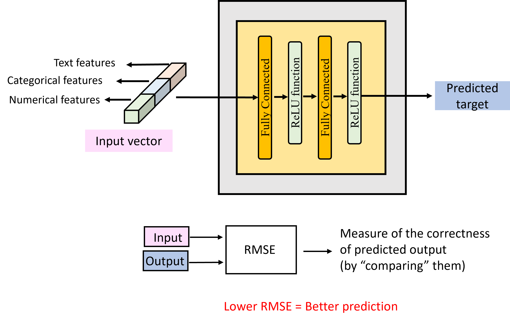

# House Rental Price Prediction using Machine Learning

This is the official code repository of the project 'House Rent Prediction'. This repository contains utilities for:
- EDA of the [real estate data](https://www.kaggle.com/datasets/corrieaar/apartment-rental-offers-in-germany) from Immoscout24
- Preprocessing and loading the dataset
- Training, Evaluation and Testing pipelines

## Data
The [data](https://www.kaggle.com/datasets/corrieaar/apartment-rental-offers-in-germany) was scraped from Immoscout24, the biggest real estate platform in Germany. Immoscout24 has listings for both rental properties and homes for sale, however, the data only contains offers for rental properties.
## Task
Task is divided into two main parts, focusing on machine learning model development for rent prediction:

1.	Predicting Rent with Structural Data: Develop a machine learning model to predict the total rent using only the structural data. Exclude the “description” and “facilities” text fields for this model.

2.	Predicting Rent with Structural and Text Data: Create a second machine learning model that predicts the total rent using both structural and text data (“description” and “facilities”). Using modern generative AI techniques for processing text data is encouraged.
## Overview of Solution
## Task 1


## Task 2


## The model architecture
For the baseline a very simple feed forward network has been chosen. In further experiments the complexity of the model architecture can be increased.



# HowTo: Model Development
This section describes the steps to train a model, evauluate the model, deploy and perform inference using TorchServe

## Installation

- Python >= 3.8  
- Create a separate environment to ensure all packages are installed correctly with the exact versions  
`conda env create --name <env name> --file=environment.yaml`

- Create a dataset folder where all the used datasets should be stored. Specify the environment variables `ITM_DIR_DATASET` and `ITM_DIR_CHECKPOINT`, leading to the paths of this dataset folder and the folder where the checkpoints are to be saved. Depending on your operating system, this can be done as follows:
    * Windows: 
        ```bash 
        setx ITM_DIR_DATASET <PATH_TO_DATASET>
        setx ITM_DIR_CHECKPOINT <PATH_TO_CHECKPOINTS>
        ```
    * Linux:
        ```bash
        export ITM_DIR_DATASET=<PATH_TO_DATASET>
        export ITM_DIR_CHECKPOINT=<PATH_TO_CHECKPOINTS>        ```
## Data preprocessing


To preprocess the data and save as numpy files run the preprocess_data.py script as follows 

```
python preprocess_data.py -server oracle -orig-path oracle_dataset_23_08/tmp/dumps/ -dest-path oracle_dataset_23_08_preprocessed

```

The resulting folder structure should look as follows. 

    ```
    ├── Host 1
    │    ├── .npy file corresponding to database/tablespace 1
    │    ├── .npy file corresponding to database/tablespace 2
    │    ├── .....
    │    ├── .npy file corresponding to database/tablespace n
    │   
    ├── Host 2
    │    ├── .npy file corresponding to database/tablespace 1
    │    ├── .npy file corresponding to database/tablespace 2
    │    ├── .....
    │    ├── .npy file corresponding to database/tablespace n
    .
    .
    .
    ```
    
## Neural Network Training - Train the AI model
To train the model use train.py. The script runs the training routine and stores the model checkponts in the specified directory

```
python train.py -dataset oracle -training-dataset-path oracle_dataset_23_05_preprocessed,oracle_dataset_23_08_preprocessed -training-num-epochs 15 -experiment MTAD_GAT/artificial_anomalies -model-name oracle_mtad_5 -feature-list 'oracle_list.txt'

```

After each epoch, the learned model (model.pth) is stored as checkpoints in the experiment folder:
```
    ├── experiment folder
        ├── checkpoints
            ├──epoch1
            |  ├──model.pth
            ├──epoch2
               ├──model.pth

```

After the complete training following information will be stored in the experiment folder:
- prediction loss (train_pred_loss.txt)
- reconstruction loss (train_recon_loss.txt)  
- total loss (train_total_loss.txt)

## Maximum values

- Maximum values computed over the training dataset are stored in the utilities folder:
    - maximum_mssql.npy
    - maximum_oracle.npy
- The maximum values will be updated for each training
- The maximum values should be used for evaluation and large scale inference using Torchserve

## Neural Network Evaluation

To test the model use test.py. The script loads the model and runs the evaluation routine

```
python test.py -dataset oracle -test-dataset-path oracle_test_preprocessed -experiment MTAD_GAT/artificial_anomalies -model-name oracle_matd_5 -model-load 'checkpoints/epoch_15' -feature-list 'oracle_list.txt'

```

After inference following information will be stored in the experiment folder:

- Model prediction output (output_pred.npy)
- Model reconstruction output (output_recon.npy)
- In case of labelled anomalies, Ground truth (targets.npy) 
- anomaly scores (anomaly_scores.npy)
- metric wise scores (full_anomaly_scores.npy)
- metric wise scores without the application of tanh function postprocessing (full_anomaly_scores_without_tanh.npy)

## Configuring Model Training and Evaluation
Default parameters can be found in arguments.py

Example:
- '-training-num-epochs',  
   type=int,  
   default=1,  
   help='Number of epochs to run the training for'

- '-training-dataset-path',  
  type=str,  
  default='oracle_dataset_23_07_preprocessed',    
  help='path to the dataset to be used for training'  

## Output Visualization
Use the following command to generate the time series plot  

```
python plotting/data_analysis.py

```


# HowTo: Model Deployment

TorchServe is an open source model serving library for pytorch models jointly developed by PyTorch & AWS. For detailed information about TorchServe please refer to the [original documentation.](https://pytorch.org/serve/)

- To install TorchServe dependencies, refer to the ['Getting started with TorchServe'](https://pytorch.org/serve/getting_started.html)

- TorchServe needs a model archive file (.mar) to serve a model. To create the model archive file:  

   - Place the following files in the model_archiver directory  
        - Model definition file with hard coded model hyperparameters (model_mssql.py/model_oracle.py)
        - Additional file for module definitions (modules.py)
        - Best Model parameters (model_mssql.pth/model_oracle.pth)
        - TorchServe handler (mtad_handler_mssql.py/mtad_handler_oracle.py)  

    - Additional files are placed in the utilities directory
        - Maximum values (maximum_mssql.npy,maximum_oracle.npy)
        - Mask for feature normaliation (mssql_norm_mask.txt,oracle_norm_mask.txt)
        - Metrics list (mssql_list.txt, oracle_list.txt)  

    - Create a directory to store your models 
    `mkdir model_store`

    - To archive the model by using the model archiver
        ```
        torch-model-archiver --model-name oracle_mtad_5  --version 1.0 --model-file <path to model definition file (model_oracle.py)> --serialized-file <path to model parameters file (model_oracle.pth)> --export-path <path to model-store directory> --extra-files <path to additional files (modules.py)> --handler <path to custom torchserve handler (mtad_handler_oracle.py)>
        ```
    - The model archive file will be stored in the model-store directory


- The docker image is pushed to the docker hub repository with the following tag  
   `rkaslikar/dockerhub:itmonitoring_v2`  
   
- To pull the docker image, get the container started and initialize the model for inference use  
    ``` 
    docker run -p 8080:8080 -p 8081:8081 -p 8082:8082 --name itmonitoring -v $(pwd)/model-store:/home/model-server/model-store -v $(pwd)/utilities:/home/model-server/utilities rkaslikar/dockerhub:itmonitoring_v2
    ```  
- To deploy/register a model
    - Bind and get the bash prompt of the running container. You will be landing at /home/model-server/  
        ```
        docker exec -it itmonitoring /bin/bash
        ```
    - Register the model  
        ```
        curl -v -X POST "http://localhost:8081/models?initial_workers=1&synchronous=true&url=mtad_gat_5.mar"
        ```

- To update the model create a new model archive file and place it in the model store directory. Make sure to update the maximum values.

## Custom APIs

The 'list' API provides all necessary information about models that are stored in the model-store directory. 

- Install dependencies
    ```
    pip install -r requirements.txt

    ```
- To run this API on the TorchServe host 
    ```
    python list.py -host '134.169.30.38' -port 8083

    ```  
  `host`: IP address of the host on which the API must run (TorchServe host)
  `port`: port on which the API listens

- To list all available models in the model-store directory
    ```
    curl "http://134.169.30.38:8083/list?category=all_models"

    ```

- To list all registered models
    ```
    curl "http://134.169.30.38:8083/list?category=registered_models"

    ```

- To list all unregistered models
    ```
    curl "http://134.169.30.38:8083/list?category=unregistered_models"

    ```

- To get the list of input feature vector metrics
    ```
    curl "http://134.169.30.38:8083/list?category=feature_list"

    ```

- To get the dimension of the input - no. of time steps, no. of metrics which a registered model expects in the input
    ```
    curl "http://134.169.30.38:8083/metadata?model_name=mtad_gat_5"

    ```

## Authors and acknowledgment
- [Rashmi Kaslikar](https://www.linkedin.com/in/rashmi-kaslikar-0072117b/), Marvin Klingner, Timo Lohrenz and Tim Fingscheidt

## License
- work based on repository with an MIT-license, everything else is still being discussed.

