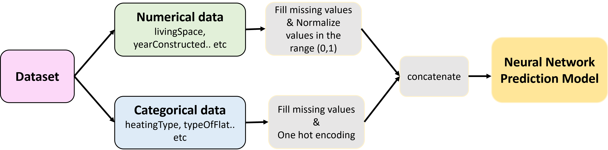

# House Rental Price Prediction using Machine Learning

This is the official code repository of the project 'House Rent Prediction'. This repository contains utilities for:
- EDA of the [real estate data](https://www.kaggle.com/datasets/corrieaar/apartment-rental-offers-in-germany) from Immoscout24
- Preprocessing and loading the dataset
- Training, Evaluation and Testing pipelines

## Data
The [data](https://www.kaggle.com/datasets/corrieaar/apartment-rental-offers-in-germany) was scraped from Immoscout24, the biggest real estate platform in Germany. Immoscout24 has listings for both rental properties and homes for sale, however, the data only contains offers for rental properties.
## Task
Task is divided into two main parts, focusing on machine learning model development for rent prediction:

1.	Predicting Rent with Structural Data: Develop a machine learning model to predict the total rent using only the structural data. Exclude the “description” and “facilities” text fields for this model.

2.	Predicting Rent with Structural and Text Data: Create a second machine learning model that predicts the total rent using both structural and text data (“description” and “facilities”). Using modern generative AI techniques for processing text data is encouraged.
## Overview of Solution
## Task 1


## Task 2


## The model architecture
For the baseline a very simple feed forward network has been chosen. In further experiments the complexity of the model architecture can be increased.


# HowTo: Model Development
This section describes the steps to train and evauluate the model

## Installation

- Python >= 3.8  
- Create a separate environment to ensure all packages are installed correctly with the exact versions  
`conda env create --name <env name> --file=environment.yaml`

- Create a dataset folder where all the used datasets should be stored. Specify the environment variables `DATASET` leading to the path of this dataset folder. Depending on your operating system, this can be done as follows:
    * Windows: 
        ```bash 
        setx DATASET <PATH_TO_DATASET>
        ```
    * Linux:
        ```bash
        export DATASET=<PATH_TO_DATASET>
       ```
## Data preprocessing

For details about feature selection and preprocessing please refer to the notebook 'eda_data.ipynb'
    
## Neural Network Training - Train the AI model
To train the model use train.py. The script runs the training routine and stores the model checkponts in the specified directory

```
python train.py -training-dataset-path immo_train.csv

```

After each epoch, the learned model (model.pth) is stored as checkpoints in the experiment folder:
```
    ├── experiment folder
        ├── checkpoints
            ├──epoch1
            |  ├──model.pth
            ├──epoch2
               ├──model.pth

```

After the complete training following information will be stored in the experiment folder:
- train loss (train_loss.txt)
- val loss (val_loss.txt)  

## Neural Network Evaluation

To test the model use test.py. The script loads the model and runs the evaluation routine

```
python test.py -test-dataset-path immo_test.csv -model-load <path to the checkpoint>

```

## Authors and acknowledgment
- [Rashmi Kaslikar](https://www.linkedin.com/in/rashmi-kaslikar-0072117b/)

## License
- work based on repository with an MIT-license, everything else is still being discussed.

